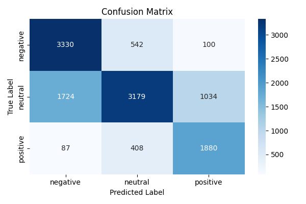

# MLOps Project

This repository is used to manage a sentiment analysis model using the CI/CD pipeline.

The model is updated and saved on the HuggingFace platform.

You can interact with it using the Python libraries `uvicorn` and `fastapi`.

The prediction results will be saved in a `csv` file.

With the interaction of the model, it is possible to classify each sentence in `negative`, `neutral` or `positive`.

## Cloning repository

You can clone the repository using:

```
git clone git@github.com:amosdisabatino/MLOps_project.git
```

Then install all dependencies using:

```
pip install --upgrade pip --break-system-packages
```

```
pip install -e . --break-system-packages
```

To use your HuggingFace token you can:

1- Go to [HuggingFace Token](https://huggingface.co/settings/tokens)

2- Copy the token

3- Login using the copied token:

```
huggingface-cli login
```

4- Create a new repository and change the `HF_REPO_DIR` variable in `config.py`

## Motivation and Architectural Choices

Transformer-based model: chosen for its excellent NLP capabilities and context management.

FastAPI + Docker: ensure lightweight, scalable and easily containerisable deployment.

Hugging Face Hub: for automatic versioning and model sharing.

CSV Logging: each prediction is saved for analysis and monitoring of real data.

## Fine Tuning Process

The model is re-trained with sentiment data of the `tweet_eval` dataset, in order to classify 3 classes (`negative`, `neutral` and `positive`).
The model trained is `cardiffnlp/twitter-roberta-base-sentiment-latest` in `HuggingFace` and its `tokenizer` is used to prepare the data.

## Last Metrics Of The Model



| accuracy | precision | recall | f1 |
|-----------|------------|--------|------|
| 0.6829 | 0.7022 | 0.6829 | 0.6765 |

|        | precision |  recall | f1-score |  support |
|--------|-----------|---------|----------|----------|
|negative|       0.65 |     0.84|      0.73|      3972|
|neutral |       0.77 |     0.54|      0.63|      5937|
|positive |      0.62 |     0.79|      0.70|      2375|
|accuracy |           |         |      0.68  |   12284 |
|macro avg |     0.68  |    0.72  |    0.69  |   12284 |
|weighted avg |   0.70  |    0.68  |    0.68  |   12284 |


Although the test dataset provided by TweetEval is unbalanced (with fewer "positive" tweets), the model performs well on this class, with relatively high recall and f1-score values.

As for the largest class (‘neutral’), performance is lower: several neutral tweets are classified as "positive" or "negative". This indicates that the model struggles to recognise texts with an ambiguous or subtle tone.
To further improve performance, class weighting or data augmentation techniques could be experimented with to better balance the distribution and reduce confusion between categories.

The overall accuracy is just below 0.70, a result partly influenced by the lower recall (0.54) of the "neutral" class. This behaviour is consistent with the difficulty, typical in sentiment analysis models, of accurately distinguishing truly neutral content from content with implicit polarity.

P.N: Results could be changed after the last trainings/tests, in this case please read the `model_results.csv` file.

## Use cases:

The model can be used to monitor a company's reputation or the quality of a product for example.

## Get started

To start using this environment, you need to pull the docker image in your local machine

```
docker pull amosdisabatino/mlops_project
```

...then run it:

```
docker run -p 8000:8000 amosdisabatino/mlops_project
```

## How Use The Apllication

You can test the model's predictions in three ways:

After starting the application with the docker command, you can run a similar command using curl (in a new terminal window):

```
curl -X POST "http://127.0.0.1:8000/predict" \
     -H "Content-Type: application/json" \
     -d '{"text": "I really love this company!"}
```

You should get a response similar to this:

```
{"label":"positive","confidence":0.9995695948600769}
```

Using a python script or from a new terminal window:

```
python3

>>> import requests
>>> resp = requests.post("http://localhost:8000/predict", json={"text": "I really love this company!"})
>>> print(resp)
<Response [200]>
>>> print(resp.json())
{'label': 'positive', 'confidence': 0.9995695948600769}

```

Or from the `http://localhost:8000/docs` url.

## Technologies used:

- Docker

- HuggingFace

- Python

- GitHub Actions

- FastAPI

- Pandas
